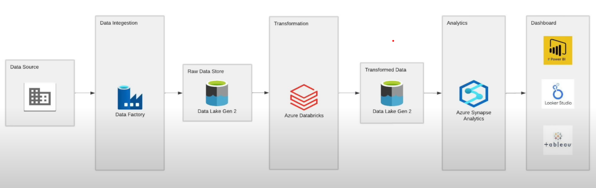

# Tokyo-Olympic-Data-Engineering-Azure

## Welcome to my Project

#### Overview
#### The Tokyo Olympics Data Engineering Project is an end-to-end data engineering solution designed to analyze and visualize data related to the Tokyo Olympics. The project leverages Microsoft Azure's suite of data services, including Azure Data Factory, Azure Data Lake Storage Gen2, Azure Databricks, Azure Synapse Analytics, and Power BI to ingest, process, transform, and visualize data.

#### Dataset Link - https://drive.google.com/drive/folders/1f4wkCZhsne-6l7B2TYL-dIoHT8SVAdnh?usp=drive_link

#### Project Architecture

#### 1. Data Source - The data is sourced from Kaggle, which contains detailed information about the Tokyo Olympics Disciplines, athletes, Medals, coaches and entries.
#### 2. Data Ingestion - Azure Data Factory (ADF) is used to orchestrate and automate the data ingestion process from Kaggle into Azure Data Lake Storage Gen2.
#### 3. Data Storage - Raw data ingested through ADF is stored in Azure Data Lake Storage Gen2 in a raw data zone.
#### 4. Data Transformation - Azure Databricks is employed for data cleaning, transformation, and preparation. The transformed data is then stored back in Azure Data Lake Storage Gen2 in a processed data zone.
#### 5. Data Analytics - Azure Synapse Analytics is used to run SQL functions and queries on the transformed data for further analysis and data modeling.
#### 6. Data Visualization - Power BI is utilized to create interactive dashboards and visualizations to present insights derived from the Tokyo Olympics data.